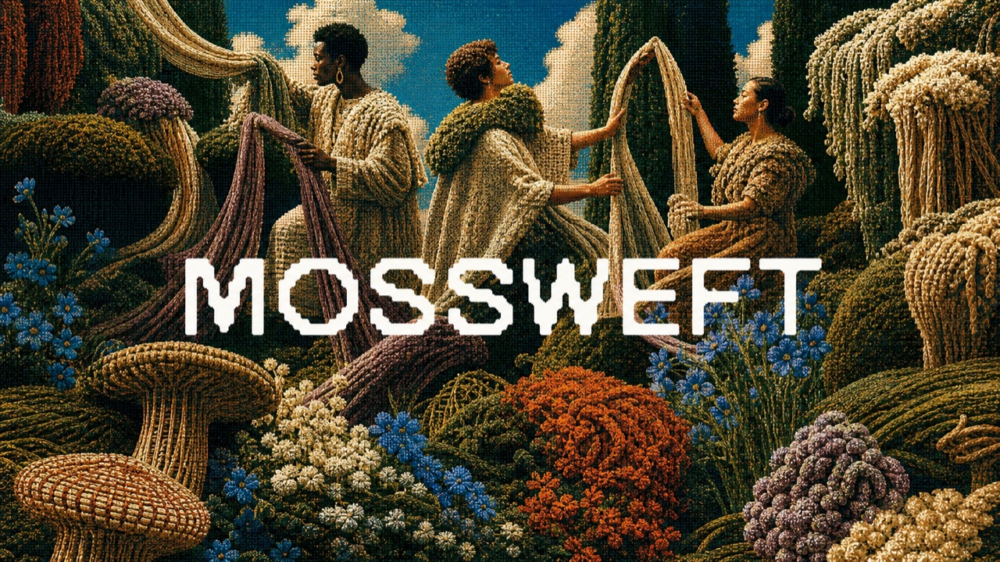
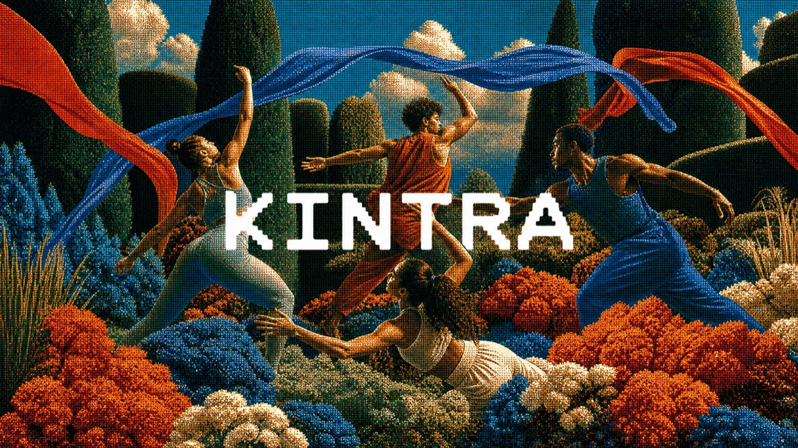
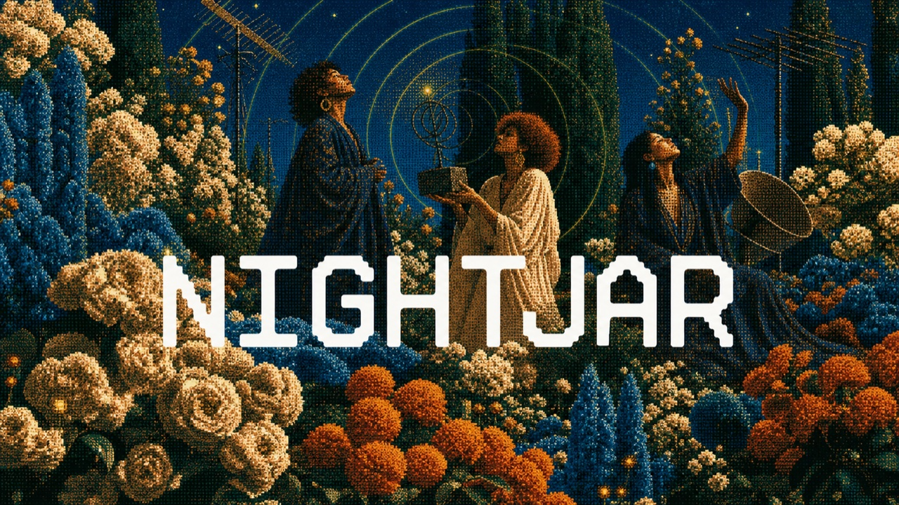
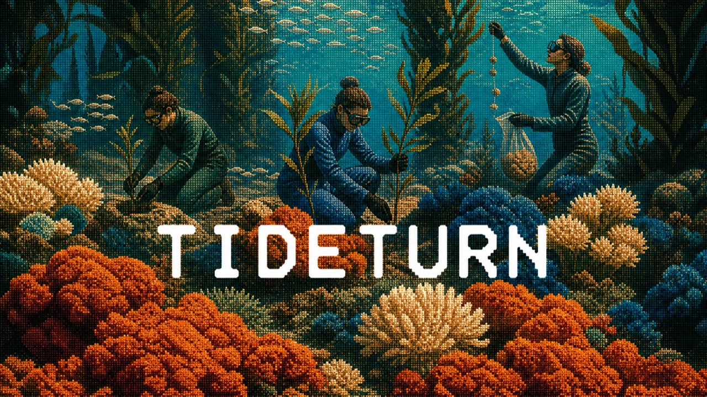
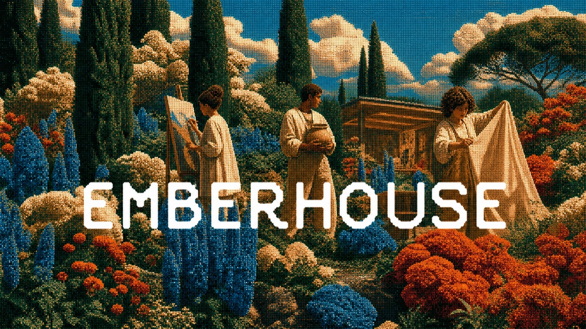

# Worked Brand-World Examples

These five examples demonstrate a 70% adjacent-family set: one shared visual grammar, five distinct brand meanings. The original third-party reference is intentionally not bundled.

## Contents

- [Shared visual spine](#shared-visual-spine)
- [MOSSWEFT](#mossweft)
- [KINTRA](#kintra)
- [NIGHTJAR](#nightjar)
- [TIDETURN](#tideturn)
- [EMBERHOUSE](#emberhouse)
- [Closer-V2 iteration](#closer-v2-iteration)

## Shared visual spine

Apply these constants to all five prompts:

```text
Asset type: 16:9 landscape brand campaign key visual.
Similarity target: approximately 70% adjacent to the primary reference's high-level visual grammar.
Style/medium: saturated vintage editorial photomontage printed like a 1970s woven tapestry; pronounced coarse halftone across the full frame; tactile analog color separation.
Composition: lush layered foreground, expressive people in the middle distance, tall organic forms and a bright sky opening behind.
Palette relationship: deep black-green shadows, cobalt blue, burnt orange, warm cream, and turquoise accents.
Typography: large white rounded geometric monospaced display wordmark across the central band; original letterforms; render the requested name exactly once.
Originality constraints: create new people, poses, clothing, objects, motif arrangement, spatial path, and wordmark design. Do not recreate the reference layout, brand, slogans, or identifiable composition.
```

## MOSSWEFT



```text
Primary request: Create an original identity image for "MOSSWEFT".
Brand meaning: A regenerative materials laboratory growing textiles from mycelium, moss, and agricultural waste.
Scene/backdrop: A theatrical biomaterial garden made from woven moss mounds, flax blossoms, mycelium forms, clipped living structures, and draped natural fibers.
Subject: Three contemporary material artists in sculptural woven clothing exchange and stretch large fiber ribbons.
Signature motif: Living textile arches growing directly from the garden.
Text (verbatim): "MOSSWEFT" — M-O-S-S-W-E-F-T.
Avoid: Generic fashion posing, literal laboratory equipment, or copied flower arrangements.
```

## KINTRA



```text
Primary request: Create an original identity image for "KINTRA".
Brand meaning: A movement and recovery collective built around rhythm, strength, and belonging.
Scene/backdrop: An abundant movement garden with sculpted grasses, rounded flower masses, dark architectural hedges, and long silk training ribbons.
Subject: Four diverse contemporary dancers and athletes form an energetic circular exchange in modern draped activewear.
Signature motif: Cobalt and orange ribbons tracing the group's shared motion.
Text (verbatim): "KINTRA" — K-I-N-T-R-A.
Avoid: Historical gowns, duplicated dance gestures, or a static group portrait.
```

## NIGHTJAR



```text
Primary request: Create an original identity image for "NIGHTJAR".
Brand meaning: An independent cultural radio station where music, essays, and field recordings come alive after dark.
Scene/backdrop: A night-blooming broadcast garden beneath a cobalt sky, with topiary towers, pale flowers, radio-wave arcs, and antenna forms hidden among plants.
Subject: Three sound artists in flowing midnight and cream garments listen upward and carry a small abstract receiver sculpture.
Signature motif: Concentric signal rings radiating through flowers and sky.
Text (verbatim): "NIGHTJAR" — N-I-G-H-T-J-A-R.
Avoid: A literal radio studio, copied rooftop imagery, or duplicated source choreography.
```

## TIDETURN



```text
Primary request: Create an original identity image for "TIDETURN".
Brand meaning: An ocean-restoration label funding kelp forests through everyday coastal products.
Scene/backdrop: An underwater garden staged as a botanical theater, with rounded coral beds, tall kelp columns, anemone clouds, turquoise water openings, and fish as delicate texture.
Subject: Three marine stewards in flowing modern dive garments plant young kelp and release seed lines.
Signature motif: Seed lines rising like living ribbons through the water.
Text (verbatim): "TIDETURN" — T-I-D-E-T-U-R-N.
Avoid: Terrestrial garden copying, generic scuba advertising, or passive swimmer poses.
```

## EMBERHOUSE



```text
Primary request: Create an original identity image for "EMBERHOUSE".
Brand meaning: A rural creative residency where artists gather, make, eat, and exchange ideas.
Scene/backdrop: A fantastical hillside residency garden at golden blue hour, with orange and cobalt blooms, tall dark trees, pale flowering clouds, and a warm studio pavilion partly hidden by plants.
Subject: Three contemporary artists hold a canvas, a ceramic vessel, and an unfurled fabric in distinct creative rituals.
Signature motif: The open pavilion glowing behind the living garden.
Text (verbatim): "EMBERHOUSE" — E-M-B-E-R-H-O-U-S-E.
Avoid: Making the building dominant, copying source figures, or using unrelated luxury-hotel cues.
```

## Closer-V2 iteration

Use this when V1 is too far from the reference:

```text
Input images: Image 1 is the primary visual-language reference; Image 2 is the current brand concept.
Primary request: Move Image 2 from a broadly inspired direction to approximately 70% adjacency with Image 1's high-level visual grammar.
Keep unchanged: exact brand name, brand meaning, core subject, and output aspect ratio.
Move closer in: scene density, depth layering, print or tapestry texture, palette relationships, theatrical human presence, and wordmark scale and placement logic.
Keep original: people, poses, clothing, motifs, spatial arrangement, exact colors, letterforms, and all source marks.
Constraints: render the brand name exactly once; no extra text; no watermark; save as V2 without overwriting V1.
```

Before accepting the result, confirm that at least four signature elements differ from the source and that the five brands still differ from one another in meaning, ritual, environment, and motif.
